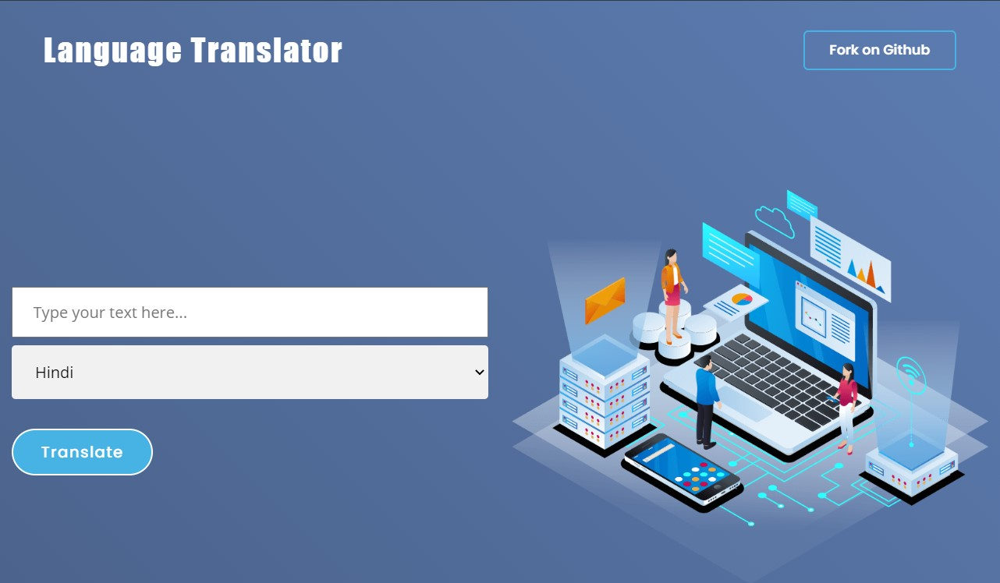
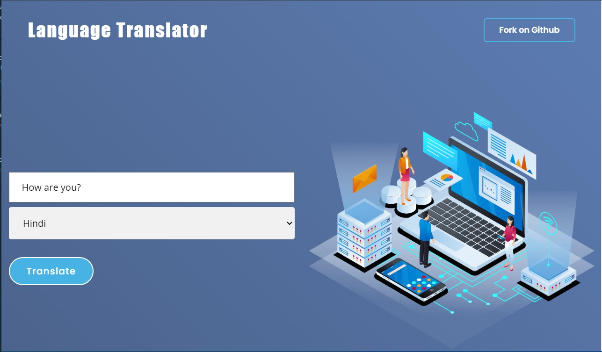
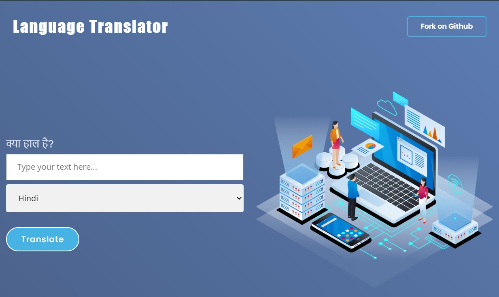
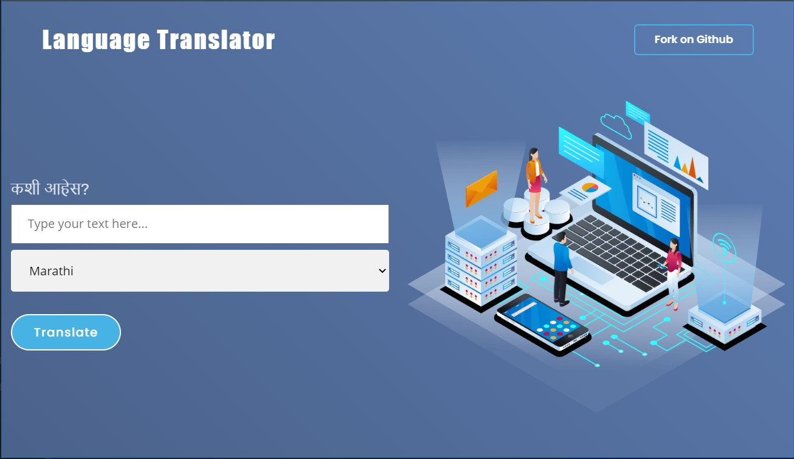

<h1 align="center">Language Translator Web App</h1>

### A  Language Translator Web Application made using Django in Python.

## Technologies Used:
1. Python
2. Django
3. HTML, CSS, JavaScript
4. Bootstrap

## Input:

## Output:

## Authors:
<a href="https://simrandhiman.me/">Simran Dhiman</a>

#### If you like this project hit ⭐

Thanks for reading 🙏🏽

